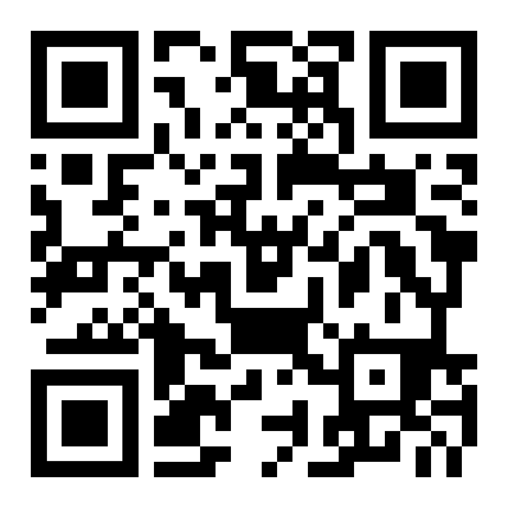

# Leaf_AR

This discursive tool seeks to engage people in technologically mediated experiences with nature as climate change fundamentally alters our experience of nature.  Our suppression of forest fires, in conjunction with climate change, has caused these now regular catastrophic seasonal events. It is a self perpetuating cycle as the carbon sequestering/ climate change mitigating power of forests is negated as their biomass burns. The tool enables the user to ‘identify’ burnt tree leaves falling from trees in burning forests. However, more importantly,  it is intended to increase awareness of relationality between ourselves and nature, with the belief that such engagement is the first step in positive futuring.

Using AR on their phone the user can view burnt leaves, which are brown, warped, broken, and sometimes bubbling, falling down around them. The leaf images used are ones posted on social media, by people either asking for help with identification or just reaching out to others to share in their disbelief of how far some of these leaves have traveled.  Many of these leaves have drifted in with ash from trees burning miles away. In that regard, the project also shows how physical distance and sense of place becomes truncated in our shared experiences of poor air quality and falling ash.

Eventually, the tool can evolve to use the user’s geolocated location, spatial analysis of fires, and machine learning to provide specific leaf identification suggestions. For example, identification suggestions can take into account specific characteristics of different leaf species when burnt, wind directions, locations of fires, proximity to fires, and data on tree types in the locations where there are fires burning.

Please use the following QR code to initiate the augmented reality experience.

